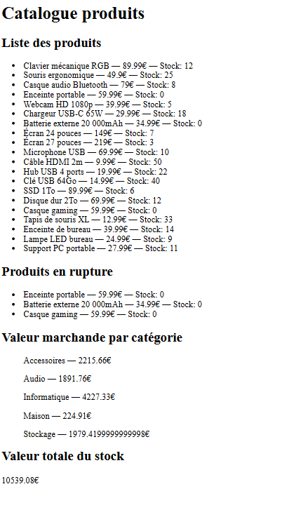

# Interagir avec des données SQLite, Python et JSON

## Contexte

Ce projet a été réalisé dans le cadre de la formation **Développeuse IA & Data** chez Simplon Microsoft.

L'objectif est de construire une pipeline complète permettant de lire des données depuis une base SQLite, les manipuler avec Python, les exporter au format JSON puis les afficher dans une interface web en JavaScript.

---

## Objectif du projet

Créer une chaîne de traitement de données complète :

SQLite → Python → JSON → JavaScript → DOM

Le projet permet de :

- Lire des données depuis une base SQLite
- Manipuler les données avec Python
- Générer des fichiers JSON exploitables
- Produire des indicateurs simples à partir des données
- Afficher les résultats dans une interface web

---

## Fonctionnalités

### Lecture des données SQLite

Connexion à une base de données contenant un catalogue de produits.

### Export JSON

Transformation automatique des données SQL vers un fichier JSON.

### Analyse des données

Calcul automatique de :

- La liste complète des produits
- Les produits en rupture de stock
- La valeur marchande par catégorie
- La valeur totale du stock

### Affichage Web

Visualisation des données dans une page HTML dynamique grâce à JavaScript.

---

## Technologies utilisées

- Python
- SQLite
- JSON
- HTML5
- JavaScript
- Git
- GitHub

---

## Structure du projet

```text
Interagir-avec-des-données-SQLite-Python-JSON/
│
├── produit.db
├── lecture.py
├── export_json.py
├── produits_complet.py
├── produits_complet.json
├── index.html
├── app.js
├── resultat.png
└── README.md
```

---

## Description des fichiers

### lecture.py

Lecture simple de la base SQLite et affichage des données récupérées.

### export_json.py

Export des données de la base SQLite vers un fichier JSON exploitable.

### produits_complet.py

Création d'un fichier JSON enrichi contenant :

- Tous les produits
- Les produits en rupture de stock
- La valeur marchande par catégorie
- La valeur totale du stock

### app.js

Chargement du fichier JSON et affichage dynamique des données dans l'interface web.

### index.html

Interface utilisateur permettant de visualiser les informations générées.

---

## Aperçu



---

## Exécution du projet

⚠️ Important :

Le projet doit être lancé via un serveur local.

Le fichier `app.js` utilise la fonction `fetch()` pour charger le fichier JSON. Certains navigateurs bloquent cette opération si le fichier `index.html` est ouvert directement avec :

```text
file:///
```

### Avec Visual Studio Code

1. Installer l'extension **Live Server**.
2. Ouvrir le dossier du projet dans Visual Studio Code.
3. Faire un clic droit sur `index.html`.
4. Sélectionner **Open with Live Server**.

Le projet sera alors accessible à une adresse similaire à :

```text
http://127.0.0.1:5500/
```

---

## Pipeline réalisée

```text
Base SQLite
      ↓
Lecture Python
      ↓
Export JSON
      ↓
Analyse des données
      ↓
Interface JavaScript
      ↓
Affichage Web
```

---

## Compétences développées

- Manipulation de bases de données SQLite
- Requêtes SQL
- Utilisation de Python pour le traitement de données
- Génération de fichiers JSON
- Manipulation de structures de données
- Développement JavaScript
- Visualisation de données
- Structuration de données
- Développement d'une pipeline de données simple
- Travail avec Git et GitHub

---

## Améliorations possibles

- Recherche de produits par nom
- Ajout de nouveaux produits via formulaire
- Modification des produits via interface web
- Contrôles de saisie JavaScript et Python
- Tableau de bord interactif
- Visualisation graphique des données

---

## Auteur

**Ursula Calderón**

Formation Développeuse IA & Data – Simplon Microsoft